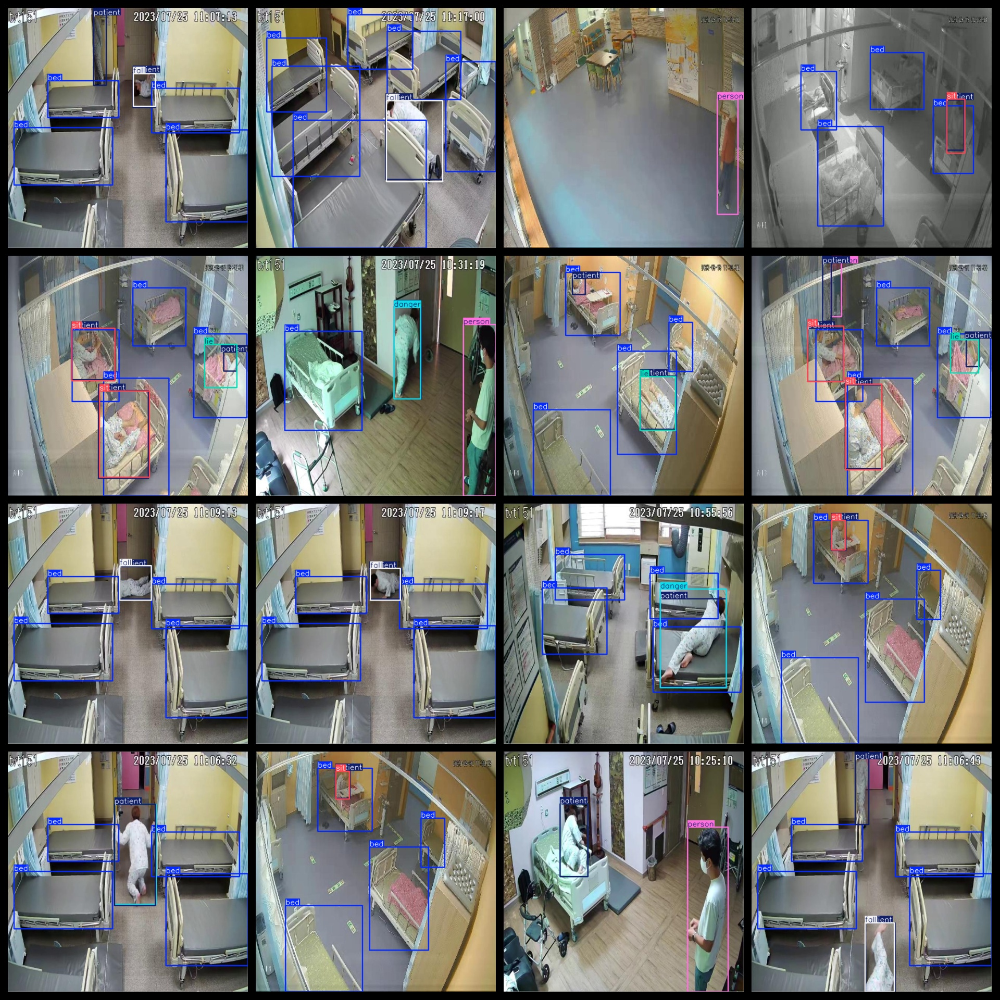

# Disease Bed Disease Person Fall Hazardous Behavior Detection Dataset 1573 imagesVOC+YOLO

Disease Bed Disease Person Fall Hazardous Behavior Detection Dataset 1573stretchVOC+YOLO

Dataset format: Pascal VOC format + YOLO format (the txt file does not contain the split path, it only contains jpg images and corresponding VOC format xml files and yolo format txt files)

Number of Images (Total jpg Count): 1573

Number of xml files: 1573

Number of txt files: 1573

Number of categories: 7

The Github repository is: datasets_sl

['person', 'bed', 'danger', 'fall', 'lie', 'patient', 'sit']

Number of boxes labeled in each category:

Bed frame count = 4792

The number of danger boxes is 469.

Fall frames = 595

lie frame count = 118

patient frame count = 2049

Number of people: 745

sit frame count = 497

Total frame count: 9265

Number of images per category:

Bed occupancy image count = 1305

Number of images with danger = 467

Fall occupies the picture count = 595

Lie occupancy = 115

patient annotated images = 1465

Person's possession of the image count = 734

Sit occupies a total of 295 pictures.

Image resolution: 640x640

Use the labeling tool: labelImg

Dataset Augmentation: No

Rules for annotation: Draw a rectangle around the category.

Important note: The dataset does not have been divided into training, validation, and testing sets.

Special Disclaimer: This dataset does not guarantee the accuracy of the trained models or weight files.

Annotation and image details are as follows:

## Images

---

Here is a pay link on Stripe (https://buy.stripe.com/3cs8yP7sY87d0vu9AB). Please contact me lonlonago@foxmail.com after funding $89, and I will send you a complete data files, thank you!

